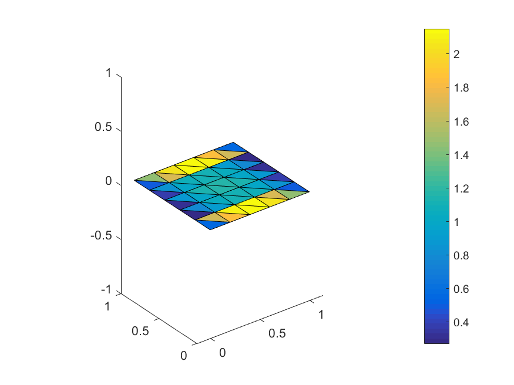

# Tutorial

```math
\newcommand{\vt}[1]{\boldsymbol{#1}}
\newcommand{\uv}[1]{\hat{\boldsymbol{#1}}}
\newcommand{\arr}[1]{\mathsf{#1}}
\newcommand{\mat}[1]{\boldsymbol{\mathsf{#1}}}
```

In this tutorial we will go through the steps required for the formulation and the solution of the scattering of a time harmonic electromagnetic wave by a rectangular plate by means of the solution of the electric field integral equation.

## Building the geometry

The sibling package `CompScienceMeshes` provides data structures and algorithms for working with simplical meshes in computational science. We will use it to create the geometry:

```@example 1
using CompScienceMeshes
using BEAST
include(Pkg.dir("BEAST","src","lusolver.jl"))
h = 0.2
Γ = meshrectangle(1.0, 1.0, h)
@show numvertices(Γ)
@show numcells(Γ)
nothing # hide
```

Next, we create the finite element space of Raviart-Thomas aka Rao-Wilton-Glisson functions subordinate to the triangulation `Γ` constructed above:

```@example 1
X = raviartthomas(Γ)
nothing # hide
```

The scattering problem is defined by specifying the single layer operator and the functional acting as excitation. Here, the plate is illuminated by a plane wave. The actual excitation is the tangential trace of this electric field. This trace be constructed easily by using the symbolic normal vector field `n` defined as part of the `BEAST` package.

```@example 1
direction = point(0,0,1)
polarisation = point(1,0,0)
wavenumber = 1.0
E = PlaneWaveMW(direction, polarisation, wavenumber)
e = (n × E) × n
nothing # hide
```

The single layer potential is also predefined by the `BEAST` package:

```@example 1
t = MWSingleLayer3D(wavenumber*im)
nothing # hide
```

It corresponds to the bilinear form

```math
t(\vt{k},\vt{j}) = \frac{1}{ik} \int_{\Gamma} \int_{\Gamma'} \nabla \cdot \vt{k}(x) \nabla \cdot \vt{j}(y) \frac{e^{-ik|x-y|}}{4\pi|x-y|} dy dx - ik \int_{\Gamma} \int_{\Gamma'} \vt{k}(x) \cdot \vt{j}(y) \frac{e^{-ik|x-y|}}{4\pi|x-y|} dy dx
```

Using the `LinearForms` package, which implements a simple form compiler for Julia (`@varform`), the EFIE can be defined and discretised by

```@example 1
using LinearForms
j, = hilbertspace(:j)
k, = hilbertspace(:k)
efie = @varform t[k,j] == e[k]
EFIE = @discretise efie k∈X j∈X
nothing # hide
```
Solving and computing the values of the induced current in the centers of the triangles of the mesh is now straightforward:

```@example 1
u = solve(EFIE)
fcr, geo = facecurrents(u,X)
nothing # hide
```

For now the package still relies upon Matlab for some of its visualisation. This dependency will be removed in the near future:

```julia
A = real.(norm.(fcr))
```


